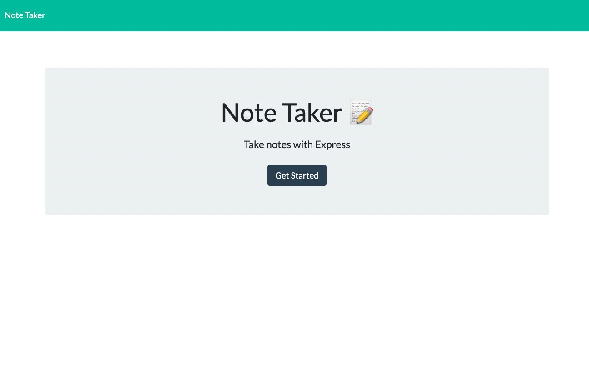
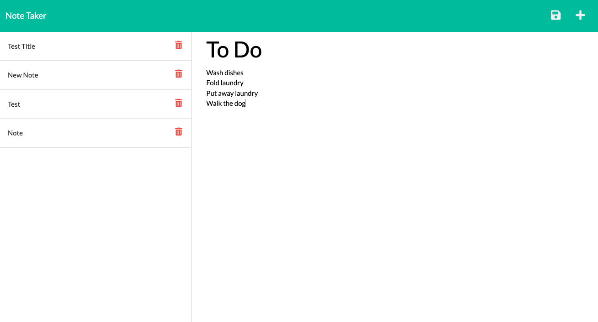
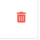

# Note-Taker

<a href="https://note-taking-application-jones.herokuapp.com/" title="Note Taker" target="_blank">Deployed Site</a>

## Description

This application uses an Express.js back end to save and retrieve note data from a JSON file.

---

| Table of Contents       |
| ----------------------- |
| [How to Use](#usage)    |
| [License](#license)     |
| [Credits](#credits)     |
| [Questions](#questions) |

---

## How to Use

This shows the start page. Users should click on "Get Started" to begin.
)

This shows the notes page. Users should enter a title and content to each note.

Users should click on the Save icon to save their note.

Users should click on the Delete icon to delete a note.

---

## License

    This project is under the following license: MIT.

Read about this license at [MIT license](https://choosealicense.com/licenses/).

---

## Credits

AskBCS tutoring service.

---

## Questions?

| Contact Me                                   |
| -------------------------------------------- |
| [GitHub](https://www.github.com/L-Jones-hub) |
| lindseyjones92@gmail.com                     |
